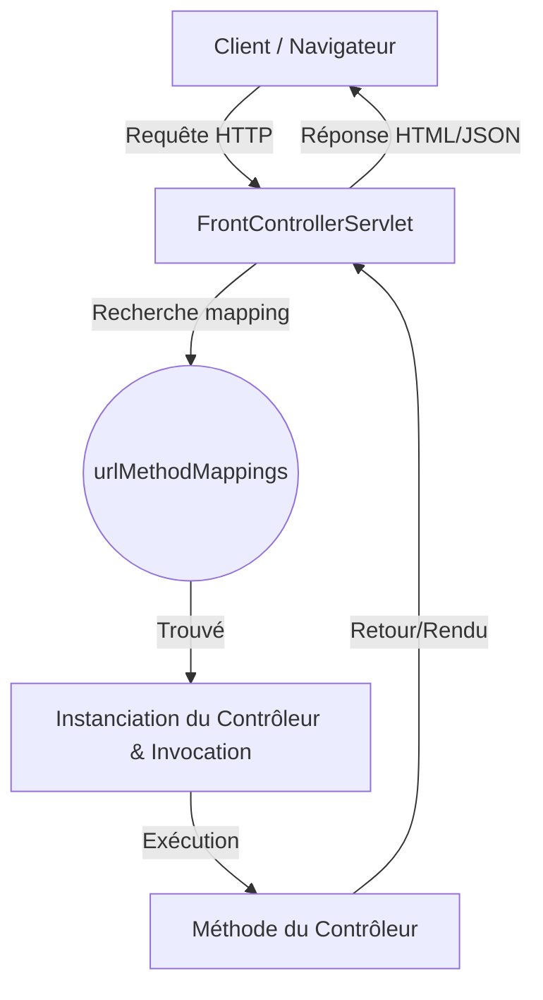

# Explication du Framework MVC Personnalisé

Ce projet est une implémentation simplifiée d'un framework **MVC (Model-View-Controller)** en Java, similaire au fonctionnement de **Spring MVC**. Il utilise l'API Servlet de Jakarta et la réflexion Java (Java Reflection) pour associer automatiquement des URLs à des méthodes spécifiques dans des classes contrôleurs.

Voici une explication détaillée du rôle de chaque composant et du flux global de l'application.

---

## 1. Architecture Globale

Le framework fonctionne selon le modèle **Front Controller** :

1. Au démarrage du serveur (Tomcat), l'**`AppListener`** scanne le package spécifié pour découvrir tous les contrôleurs et leurs URLs associées, puis les stocke en mémoire.
2. Lorsqu'un utilisateur envoie une requête HTTP (ex. `GET /Test`), le **`FrontControllerServlet`** (le Front Controller unique) l'intercepte.
3. Il recherche dans sa table de routage si une méthode correspond à cette URL et à cette méthode HTTP.
4. Si elle existe, il instancie le contrôleur et exécute la méthode par réflexion. Sinon, il affiche une page d'erreur 404 avec la liste des mappings disponibles.

---

## 2. Rôle des Composants

### A. Les Annotations (Méta-données)
Elles servent à marquer les classes et les méthodes pour que le framework puisse les identifier automatiquement.

*   **[`@Controller`](file:///home/main/Documents/L2/s4/Spring/Sprint_vrai%20%28Copie%29/src/mg/itu/annotation/Controller/Controller.java)** : 
    Marque une classe Java comme étant un contrôleur. Seules les classes avec cette annotation seront inspectées par le framework.
*   **[`@UrlMapping`](file:///home/main/Documents/L2/s4/Spring/Sprint_vrai%20%28Copie%29/src/mg/itu/annotation/Url/UrlMapping.java)** : 
    Placée sur une méthode à l'intérieur d'un contrôleur. Elle définit :
    *   `value` : l'URL à intercepter (ex: `/Test`).
    *   `method` : la méthode HTTP autorisée (`GET`, `POST`, etc., par défaut `GET`).

### B. Le Scanner de Package
*   **[`PackageScanner.java`](file:///home/main/Documents/L2/s4/Spring/Sprint_vrai%20%28Copie%29/src/mg/itu/utils/PackageScanner.java)** : 
    Cette classe utilitaire parcourt le dossier correspondant à un package donné (par exemple `controlleur`) et récupère la liste de tous les noms de classes compilées (fichiers `.class`) qui s'y trouvent.

### C. L'Initialisation du Framework
*   **[`AppListener.java`](file:///home/main/Documents/L2/s4/Spring/Sprint_vrai%20%28Copie%29/src/mg/itu/Servlet/AppListener.java)** : 
    C'est un `ServletContextListener`. Il s'exécute **une seule fois** au démarrage de l'application Web.
    1. Il lit le paramètre d'initialisation `controllerPackage` dans le fichier `web.xml` (sinon il utilise `"controlleur"` par défaut).
    2. Il liste toutes les classes de ce package via `PackageScanner`.
    3. Pour chaque classe, s'il trouve l'annotation `@Controller`, il parcourt ses méthodes.
    4. Pour chaque méthode annotée avec `@UrlMapping`, il extrait l'URL et la méthode HTTP.
    5. Il crée une clé `UrlMethod(url, httpMethod)` et y associe un `MethodInfo(className, methodName)`.
    6. **Gestion des doublons** : Si deux méthodes différentes tentent d'écouter sur la même URL avec la même méthode HTTP, le framework lève immédiatement une exception au démarrage pour éviter les conflits.

### D. Le Dispatcher (Aiguillage des requêtes)
*   **[`FrontControllerServlet.java`](file:///home/main/Documents/L2/s4/Spring/Sprint_vrai%20%28Copie%29/src/mg/itu/Servlet/FrontControllerServlet.java)** : 
    C'est la servlet principale qui reçoit toutes les requêtes (méthodes `doGet`, `doPost`, `doPut`, `doDelete` redirigées vers `processRequest`).
    1. Il extrait l'URI de la requête et la méthode HTTP (ex: `GET` et `/Test`).
    2. Il cherche dans `AppListener.urlMethodMappings` s'il existe une correspondance.
    3. **Si trouvé** :
        * Il charge la classe contrôleur correspondante par réflexion : `Class.forName(...)`.
        * Il crée une nouvelle instance de cette classe.
        * Il cherche si la méthode attend des paramètres de type `HttpServletRequest` et `HttpServletResponse`. Si oui, il les lui passe. Sinon, il l'invoque sans argument.
    4. **Si non trouvé** : Il affiche une page 404 dynamique montrant la liste de toutes les routes configurées dans l'application pour aider au débogage.

---

## 3. Modèles de Données Auxiliaires

*   **[`UrlMethod.java`](file:///home/main/Documents/L2/s4/Spring/Sprint_vrai%20%28Copie%29/src/mg/itu/utils/UrlMethod.java)** : 
    Représente la combinaison unique d'une **URL** et d'une **Méthode HTTP**. Il redéfinit `equals()` et `hashCode()` pour pouvoir être utilisé comme clé unique dans la Map globale des mappings.
*   **[`MethodInfo.java`](file:///home/main/Documents/L2/s4/Spring/Sprint_vrai%20%28Copie%29/src/mg/itu/utils/MethodInfo.java)** : 
    Contient le nom de la classe cible et de la méthode cible à invoquer par réflexion lorsqu'une URL correspondante est appelée.

---

## 4. Script de Compilation et Déploiement

Le fichier **[`compile.sh`](file:///home/main/Documents/L2/s4/Spring/Sprint_vrai%20%28Copie%29/compile.sh)** automatise le processus :
1. Il supprime les résidus des builds précédents (dossier `bin` et fichier `framework.jar`).
2. Il crée un nouveau dossier `bin`.
3. Il compile le code Java en ciblant Java 17 avec le Jar de l'API Servlet de Jakarta en classpath (`lib/jakarta.servlet-api-6.0.0.jar`).
4. Il package le résultat dans un fichier `framework.jar`.
5. Il copie automatiquement ce Jar dans le dossier `lib` de l'application de test (`Application_test`) pour qu'elle puisse utiliser le framework.
